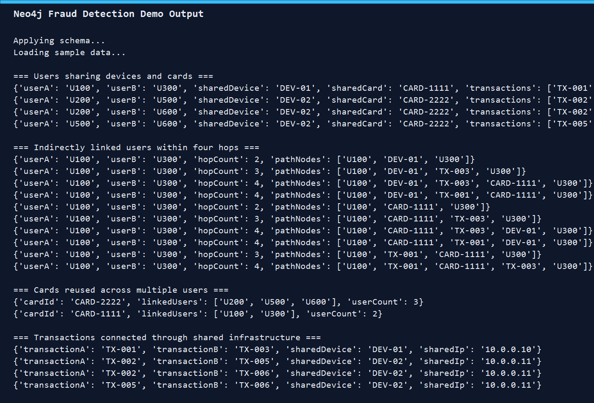

# Fraud Detection Graph Database Summary

## Overview

This project is a fraud-detection prototype built to show how a graph database can uncover suspicious relationship patterns between users and transactions more effectively than a traditional relational model.

The core idea is simple: fraud rarely happens in isolation. Even when individual transactions look normal on their own, they often become suspicious when we analyze how people, cards, devices, IP addresses, and merchants are connected.

Instead of storing this information only as rows in separate tables, this project models the system as a graph in Neo4j. That allows us to traverse relationships across multiple hops and detect hidden links such as:

- multiple users sharing the same payment card
- different accounts operating from the same device
- transactions routed through the same IP address
- indirect user-to-user connections formed through cards, devices, or prior transactions

This is exactly the kind of relationship-heavy problem where graph databases are especially strong.

## What We Are Trying To Achieve

The goal of this code is to simulate a real fraud investigation workflow.

We want to answer questions like:

- Are multiple users connected to the same card or device?
- Are there clusters of accounts that look unrelated at first glance but are actually linked through shared infrastructure?
- Can we detect suspicious chains of activity across two, three, or four hops in the graph?
- Which cards or devices appear across several users or transactions and should be flagged for review?

In a normal SQL-style workflow, these kinds of checks can require complex joins that quickly become hard to maintain and hard to reason about. In Neo4j, relationship traversal is the natural way to solve the problem.

So the broader objective of the project is not just to store transaction data. It is to turn the data into an investigation-ready relationship graph and use Cypher queries to surface fraud signals automatically.

## Why Neo4j Was Used

Neo4j is a strong fit for this use case because fraud is fundamentally a network problem.

A fraud analyst usually does not care only about one transaction. They care about how that transaction connects to:

- the user who initiated it
- the card that funded it
- the device used to perform it
- the IP address it came from
- the merchant that received it
- any other users or transactions that reuse the same entities

That means the value comes from the edges between records, not just the records themselves.

Neo4j lets us model those edges directly and then query across them efficiently. This makes it possible to build explainable fraud signals such as:

- shared-card risk
- shared-device risk
- shared-IP infrastructure risk
- indirect multi-hop user linkage
- transaction clustering around common entities

## Graph Model

This project models the following node types:

- `User`
- `Transaction`
- `Card`
- `Device`
- `IPAddress`
- `Merchant`

The important relationships include:

- `(:User)-[:MADE]->(:Transaction)`
- `(:Transaction)-[:USED_CARD]->(:Card)`
- `(:Transaction)-[:USED_DEVICE]->(:Device)`
- `(:Transaction)-[:USED_IP]->(:IPAddress)`
- `(:Transaction)-[:AT_MERCHANT]->(:Merchant)`
- `(:User)-[:OWNS_CARD]->(:Card)`
- `(:User)-[:REGISTERED_DEVICE]->(:Device)`

This structure is what allows the code to ask relationship-oriented questions rather than just row-based questions.

## How The Code Works

The project is split into three main parts.

### 1. Schema setup

The file `cypher/schema.cypher` creates uniqueness constraints for the major entities such as users, transactions, cards, devices, IPs, and merchants.

This ensures the graph stays consistent and prevents duplicate core nodes from being created accidentally.

### 2. Sample graph data

The file `cypher/sample_data.cypher` loads a synthetic dataset designed specifically to demonstrate fraud-like behavior.

The data intentionally creates suspicious overlaps, including:

- the same card being used by more than one user
- the same device appearing in multiple transactions
- users connected through shared infrastructure

This dataset is small enough to understand easily, but rich enough to demonstrate meaningful graph traversal.

### 3. Detection queries

The file `cypher/detection_queries.cypher` contains the Cypher rules that search the graph for suspicious patterns.

These queries detect:

- users sharing both devices and cards
- indirect user links within multiple hops
- cards reused across several users
- transactions connected through shared device and IP infrastructure

### 4. Python runner

The file `src/app.py` ties everything together.

It:

1. connects to Neo4j
2. waits until the database is ready
3. applies the schema
4. loads the sample data
5. runs the fraud-detection queries
6. prints the suspicious patterns in a readable format

This makes the demo reproducible end to end.

## What The Output Shows

Below is the generated screenshot from the demo run:

The output shows that the graph model is doing exactly what we want it to do.

Some of the strongest findings include:

- `U100` and `U300` sharing both `DEV-01` and `CARD-1111`
- `U200`, `U500`, and `U600` being linked through the same card and device infrastructure
- transaction pairs like `TX-002` and `TX-005` sharing both a device and an IP address
- multi-hop paths showing how one user can be connected to another through cards, devices, and transactions

This matters because these are realistic fraud signals. In production systems, these kinds of patterns often suggest account takeover, synthetic identity behavior, card sharing, mule networks, or coordinated abuse.

## What This Demonstrates Technically

This code demonstrates several important engineering ideas:

- graph data modeling for a real-world risk use case
- Cypher query design for multi-hop investigation
- reproducible local infrastructure using Docker Compose
- Python-based orchestration of database setup and detection logic
- explainable fraud rules instead of black-box scoring

It is not meant to be a full production fraud engine. Instead, it is a focused prototype that shows how graph-based reasoning can be applied to suspicious transaction analysis.

## Practical Outcome

The real achievement of this project is that it transforms raw transactional entities into a relationship intelligence system.

Rather than asking only "was this transaction large?" or "did this user do something unusual?", the code asks better questions:

- Who else is connected to this activity?
- What infrastructure is being reused?
- How many hops away is another suspicious account?
- Which cards or devices are acting like hubs in the network?

Those are the questions that make graph databases valuable in fraud detection.

## Final Takeaway

This project exists to show how Neo4j can be used to model and detect fraud through relationships.

By combining:

- a graph-based data model
- synthetic but realistic suspicious patterns
- multi-hop Cypher queries
- a runnable Python workflow

the repository demonstrates how hidden fraud connections can be surfaced clearly, reproducibly, and in a way that is easy to explain during interviews, portfolio reviews, or technical discussions.
